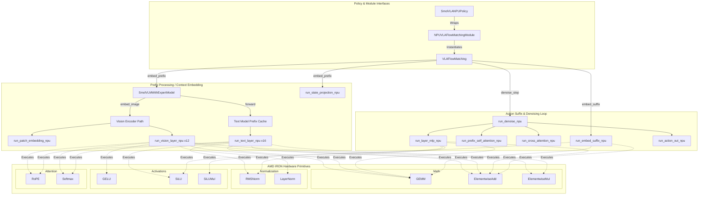

# `smolvla_npu.py`

`IRON/iron/applications/smolvla_npu3/smolvla_npu.py` is a single-file SmolVLA inference port for AMD NPU. It mirrors the original LeRobot SmolVLA policy, but replaces many PyTorch tensor operations with fixed-shape IRON operators.

## Model Flow

The flowchart for my implementation is like the following.

